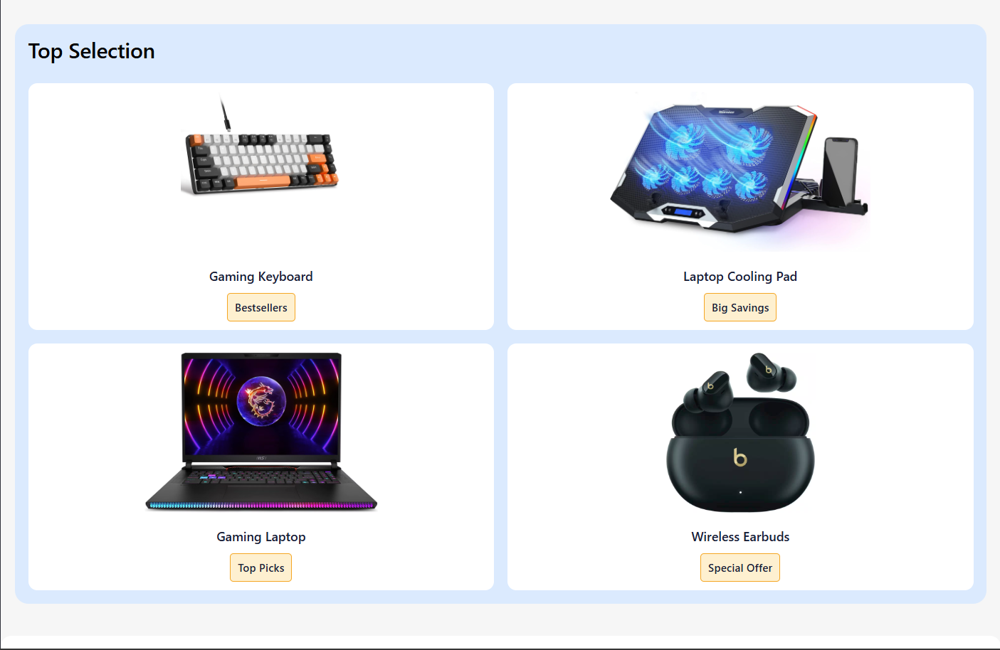
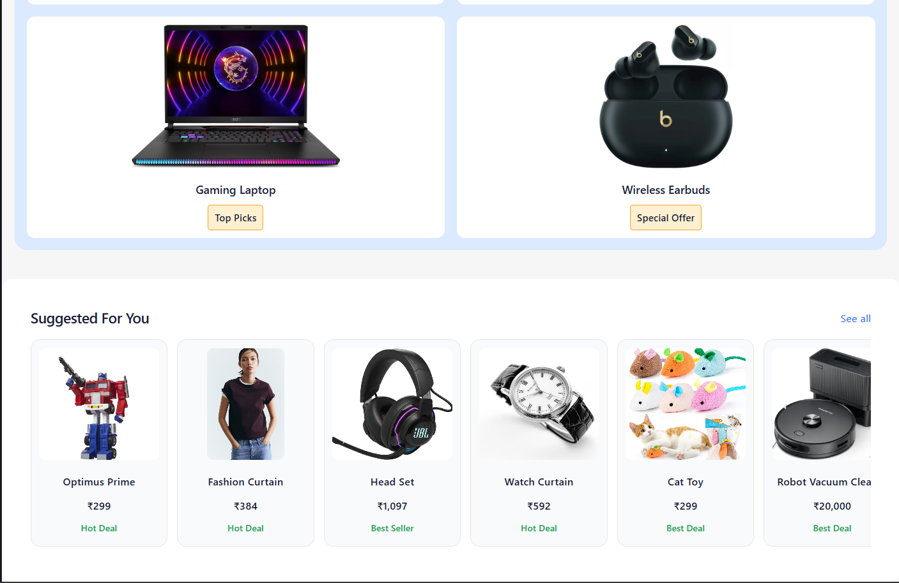
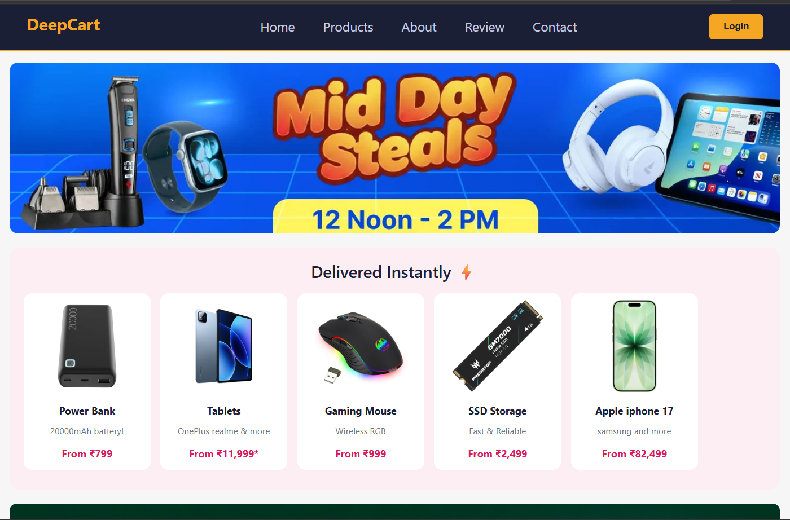
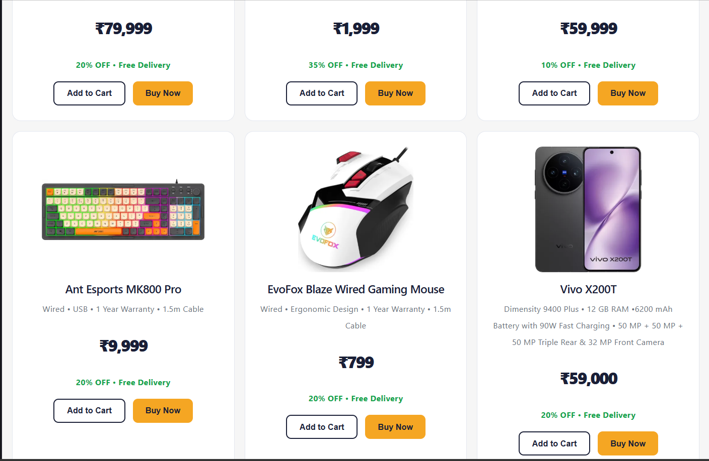
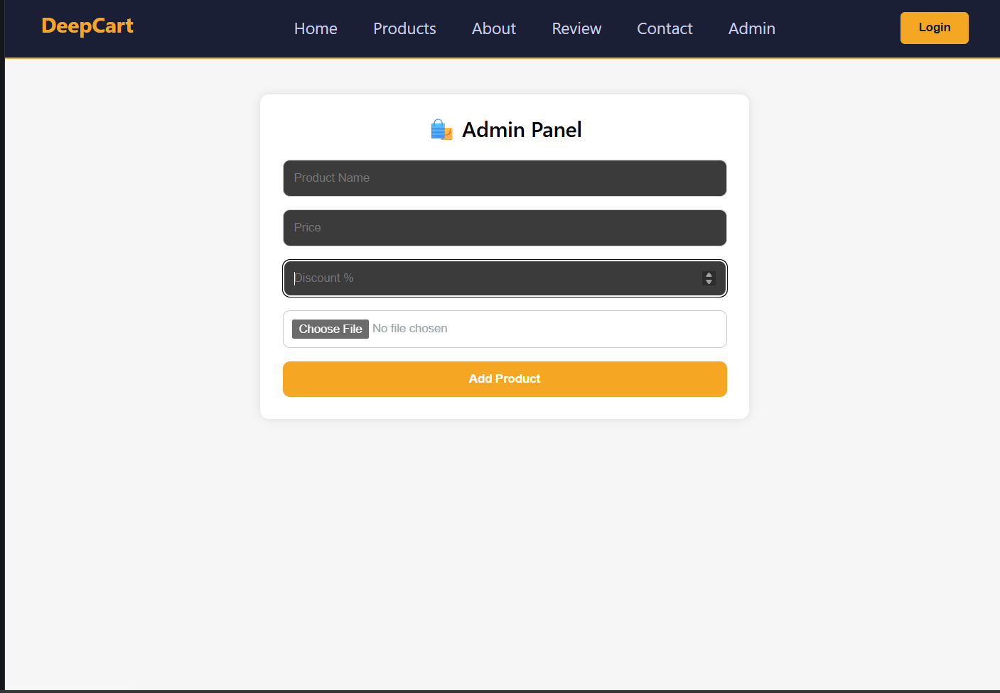
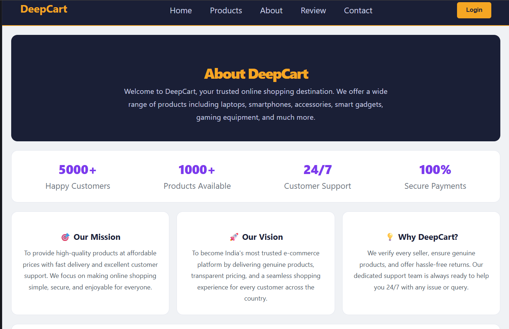
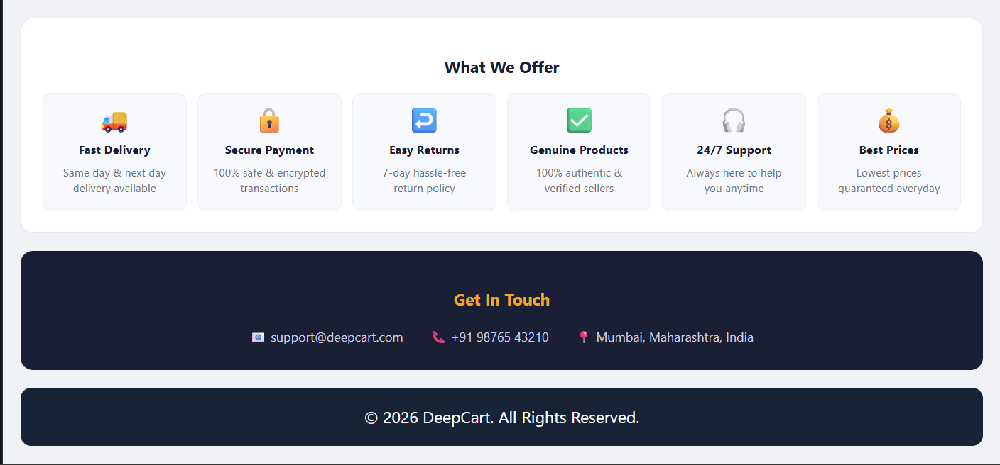
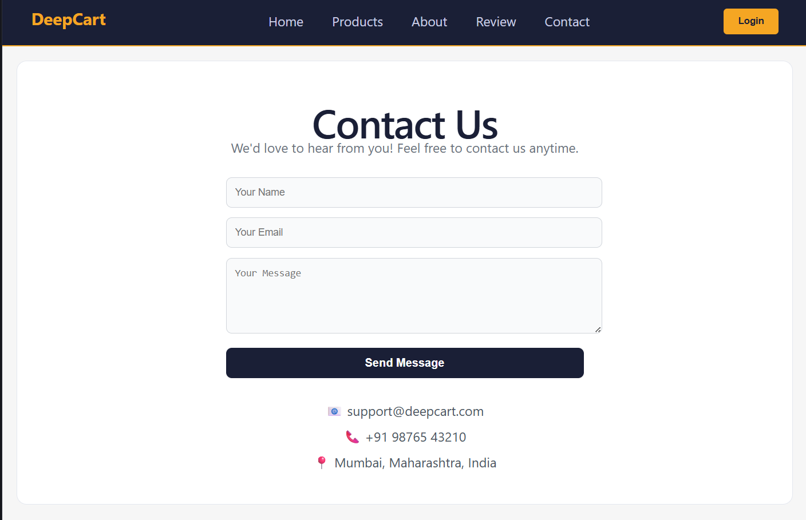
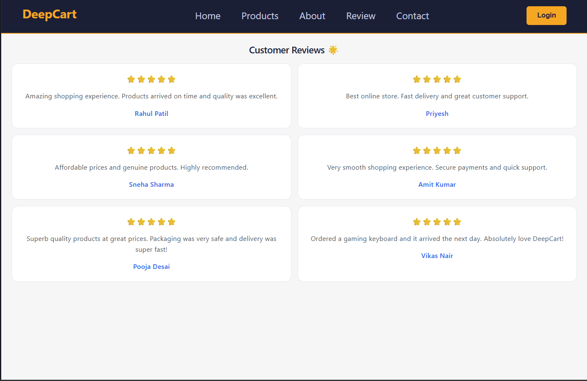

<div align="center">

# 🛒 DeepCart
### React E-Commerce Website


*A modern, responsive E-Commerce UI built with React.js — featuring a clean product catalog, customer reviews, and smooth navigation.*

</div>

---

## 📸 Screenshots

### 🏠 Home Page




### 📦 Product Page




### 🛡️ Admin Page


### ℹ️ About Page



### 📞 Contact Page


### ⭐ Reviews Page


---

## ✨ Features

| Feature | Description |
|---|---|
| 🏠 Home Page | Banner, top selection grid & suggested products |
| 📦 Product Page | Horizontal scroll cards & featured product grid |
| 🛡️ Admin Page | Admin dashboard for managing products & orders |
| 🔑 Admin Login | Secure login page for admin access |
| 🔒 Protected Routes | Route guards to restrict unauthorized access |
| ⭐ Reviews Page | 6 customer reviews in responsive 2-column grid |
| 📞 Contact Page | Contact form with fields |
| ℹ️ About Page | Project & developer info |
| 🔐 Navbar | Login button & active link highlighting |
| 📱 Responsive | Fully responsive on mobile & desktop |
| 🎨 Modern UI | Consistent color theme & clean design |

---

## 🛠️ Technologies Used

| Technology | Purpose |
|---|---|
| ⚛️ React.js | Frontend UI Library |
| 🔀 React Router DOM | Page Routing |
| ⚡ Vite | Build Tool & Dev Server |
| 🟨 JavaScript (ES6+) | Logic & Interactivity |
| 🎨 CSS-in-JS (Inline Styles) | Styling |
| 🌐 HTML5 | Markup |

---

## 📁 Project Folder Structure


```

DeepCart/
├── 📁 public/
├── 📁 screenshots/
│   ├── about.png
│   ├── about1.png
│   ├── Admin.png
│   ├── contect.png
│   ├── home.png
│   ├── home1.png
│   ├── home2.png
│   ├── product1.png
│   ├── product3.png
│   ├── product4.png
│   └── review.png
├── 📁 src/
│   ├── 📁 assets/
│   │   ├── appq.png
│   │   ├── hero.png
│   │   ├── react.svg
│   │   ├── sale.png
│   │   └── vite.svg
│   ├── About.jsx
│   ├── Admin.jsx
│   ├── AdminLogin.jsx
│   ├── App.css
│   ├── App.jsx
│   ├── Application.js
│   ├── Contact.jsx
│   ├── Home.jsx
│   ├── index.css
│   ├── main.jsx
│   ├── Navbar.jsx
│   ├── Product.jsx
│   ├── ProtectedRoute.jsx
│   └── Review.jsx
├── .gitignore
├── eslint.config.js
├── index.html
├── package-lock.json
├── package.json
├── README.md
└── vite.config.js

```

---

## ⚙️ Installation & Setup

> Make sure you have **Node.js** installed on your system.

```bash
# 1. Clone the repository
git clone [https://github.com/DeepBirwadkar/deepcart.git](https://github.com/DeepBirwadkar/deepcart.git)

# 2. Navigate into the project folder
cd deepcart

# 3. Install dependencies
npm install

```

---

## ▶️ How to Run

```bash
npm run dev

```

Then open your browser and go to:

```
http://localhost:5173

```

---

## 🚀 Future Enhancements

* [ ] 🔐 User Authentication (Login / Register)
* [ ] 🛒 Add to Cart & Wishlist functionality
* [ ] 💳 Payment Gateway Integration
* [ ] 🔍 Product Search & Filter
* [ ] 🌙 Dark Mode Toggle
* [ ] 🗄️ Backend API with Node.js + MongoDB

---

## 👨‍💻 Author

### Deep Birwadkar

🎓 Diploma Engineering — Semester IV (MSBTE K-Scheme)

💻 React.js  |  Java  |  Python

---

## 📄 License

This project is created for **educational purposes** as part of a college assignment.

© 2025 **Deep Birwadkar**. All rights reserved.

